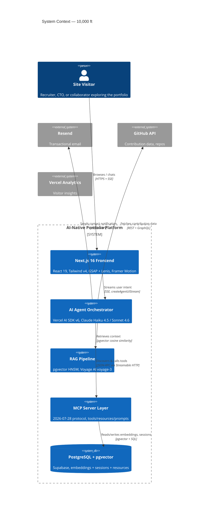
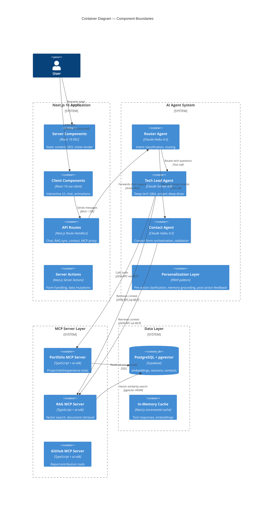
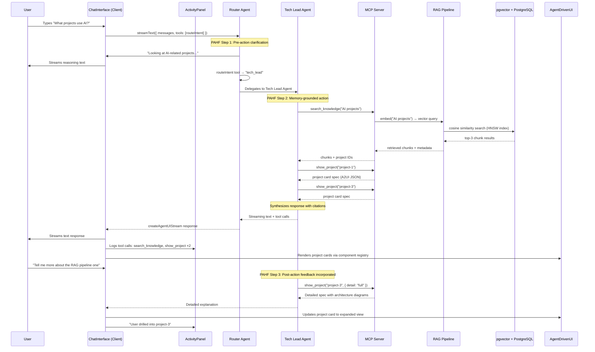
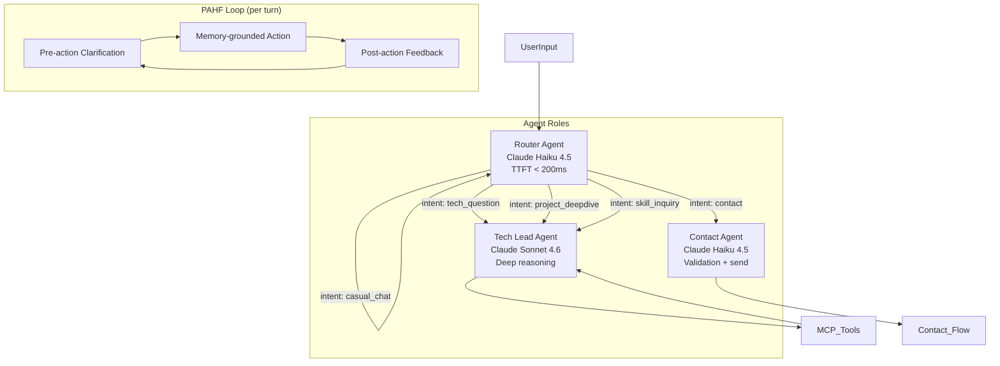
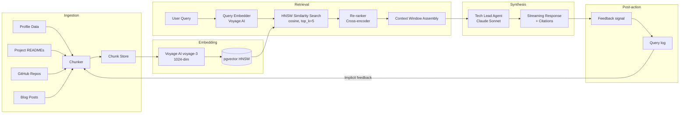
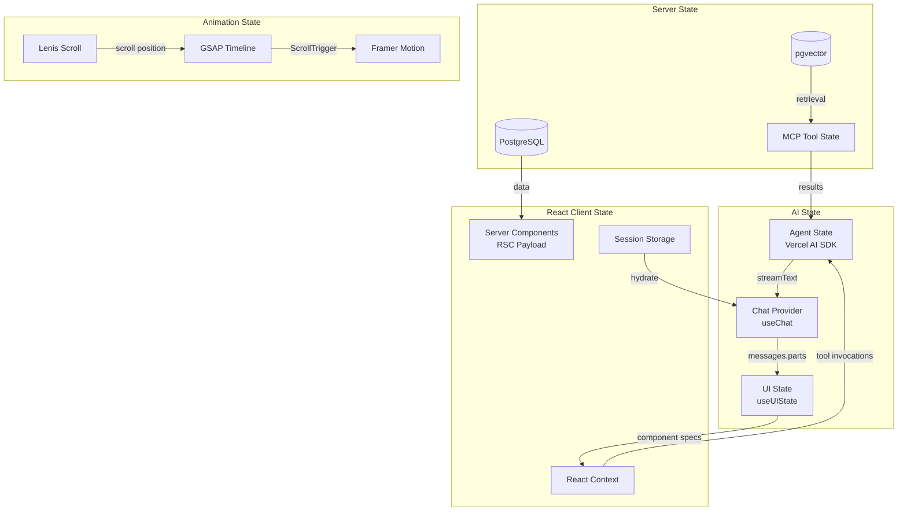

# AI-Native Interactive Portfolio Platform — Architecture

## 1. High-Level Architecture





---

## 2. Component Tree & Responsibilities

```
RootLayout (RSC)
├── Providers (Client)
│   ├── ThemeProvider          — Tailwind v4 @theme dark/light, system preference
│   ├── LenisProvider          — Smooth scroll context (duration: 1.2, easing: pow2)
│   └── ChatProvider           — Vercel AI SDK useChat + useUIState/useActions
│
├── CinematicIntro (Client)     — Full-viewport WebGL canvas + GSAP timeline
│   ├── ParticleField           — Three.js / tsParticles, mouse-reactive
│   └── HeroTitle               — GSAP SplitText reveal, staggered chars
│
├── Navigation (Client)
│   ├── NavBar                  — Fixed top, glassmorphism, blur backdrop
│   └── Dock                    — macOS-style dock with section shortcuts (Lenis scrollTo)
│
├── AboutSection (RSC)          — Static bio, experience timeline
│   └── ExperienceTimeline      — Framer Motion AnimatePresence, staggered reveal
│
├── SkillsSection (Client)
│   ├── SkillCategories         — Grouped by domain (Frontend, AI, Cloud...)
│   └── SkillBar                — GSAP width tween on scroll enter (ScrollTrigger)
│
├── ProjectShowcase (Client)    — Core interactive section
│   ├── ProjectGrid             — CSS Grid, reactive layout
│   │   └── ProjectCard         — Framer Motion hover + tap, GSAP parallax thumbnail
│   ├── ProjectModal            — Deep-dive overlay with tech stack, links, demo
│   └── FilterBar               — Agent-driven category pills
│
├── ContactSection (Client)
│   ├── ContactForm             — Server Action + Resend integration
│   └── AgentContactUI          — AI-driven dynamic form (A2UI pattern)
│
├── ChatInterface (Client)      — Primary AI interaction surface
│   ├── MessageList             — Virtualized, auto-scroll, streaming text
│   │   ├── UserMessage         — User bubble
│   │   ├── AssistantMessage    — Streaming text + reasoning block
│   │   └── ToolInvocation      — Agent tool call + result (collapsible)
│   ├── ActivityPanel           — Right sidebar, persistent agent audit log
│   │   ├── StepProgress        — Plan-and-execute steps
│   │   ├── ToolCallLog         — Every tool invocation with input/output
│   │   └── ErrorSurface        — Structured what/why/next errors
│   ├── InputBar                — Text + voice (Web Speech API) + suggested queries
│   └── SuggestionChips         — Context-aware starting points (agent-generated)
│
├── AgentDrivenUI (Client)      — Declarative GenUI component registry
│   ├── ProjectCardAgent        — Rendered when agent calls show_project tool
│   ├── SkillChartAgent         — Rendered when agent calls show_skills tool
│   ├── TimelineAgent           — Rendered when agent calls show_timeline tool
│   ├── ComparisonTable         — Rendered for "compare X vs Y" queries
│   └── CodeBlockAgent          — Syntax-highlighted code snippets
│
└── Footer (RSC)                — Social links, copyright, MCP badge
```

### Component Responsibility Matrix

| Component | Render Strategy | Data Source | Animation Driver |
|---|---|---|---|
| CinematicIntro | Client (canvas) | Static config | GSAP + Three.js |
| HeroTitle | Client (split text) | Static config | GSAP SplitText |
| ExperienceTimeline | RSC → hydrate | SQL/profile.json | Framer Motion |
| SkillBar | Client (scroll) | SQL/profile.json | GSAP ScrollTrigger |
| ProjectCard | Client (scroll) | SQL/projects | GSAP + Framer Motion |
| ChatInterface | Client (stateful) | SSE from API | CSS transitions |
| ActivityPanel | Client (stateful) | Agent stream parts | Framer Motion |
| AgentDrivenUI | Client (registry) | A2UI JSON from agent | Framer Motion |

---

## 3. Data Flow — User → AI → Tool → UI



### Stream Protocol (Vercel AI SDK v6 createAgentUIStream)

```
Client → POST /api/chat → Router Agent
   ↓
Router Agent emits message.parts:
   [
     { type: 'text', text: 'Let me look into that...' },
     { type: 'tool-call', toolName: 'routeIntent', args: { intent: 'tech_lead' } },
     { type: 'tool-result', toolName: 'routeIntent', result: { agent: 'tech_lead' } },
     { type: 'source', source: { type: 'rag', title: 'Project Alpha', url: '...' } },
     { type: 'reasoning', reasoning: 'User is asking about AI projects...' },
     { type: 'tool-call', toolName: 'show_project', args: { id: 'project-3' } },
     { type: 'tool-result', toolName: 'show_project', result: { component: 'ProjectCard', props: {...} } },
     { type: 'text', text: 'Here are the projects...' }
   ]
   ↓
Client useChat hook → message.parts iteration
   → text parts → ChatMessage
   → tool-call/tool-result → ActivityPanel (collapsible)
   → source → Citation markers
   → reasoning → ReasoningBlock (expandable)
   → tool-result with component → AgentDrivenUI (registry render)
```

---

## 4. Tech Stack Decisions

### Core Framework: Next.js 16 (App Router)

**Why Next.js 16 over alternatives:**

| Criterion | Next.js 16 | Remix | Astro | Vite SPA |
|---|---|---|---|---|
| RSC streaming | Native | No | Partial (islands) | No |
| AI SDK integration | First-party Vercel | Community | Limited | Manual |
| Turbopack dev speed | ~50ms HMR | ~200ms HMR | ~100ms HMR | ~30ms (Vite) |
| Image optimization | Built-in | Plugin | Built-in | Manual |
| SSE for chat | Route Handlers | loaders | API routes | Express needed |
| MCP server co-location | Edge + Node | Node only | Node only | Node only |

**Decision**: Next.js 16's RSC streaming SSR gives us zero-JS initial paint for SEO (critical for portfolio discoverability), while Turbopack's sub-50ms HMR keeps the GSAP/Lenis animation iteration loop fast. The Vercel AI SDK is a first-class citizen — `createAgentUIStream` + `useChat` are built for this runtime.

### AI Model: Claude Haiku 4.5 (Router) + Sonnet 4.6 (Tech Lead)

**Why Claude over alternatives:**
- **Haiku 4.5**: 200ms TTFT, $0.25/M tokens — router agent processes hundreds of intents per session at negligible cost. The router's job is classification + delegation, not depth.
- **Sonnet 4.6**: Best-in-class tool use accuracy (>94% on Berkeley Function Calling Leaderboard as of mid-2026), critical when the agent calls show_project, search_knowledge, and show_skills which must produce valid A2UI JSON.
- **Gemini 2.5 Flash** is competitive on speed but trails on tool-calling reliability for multi-step workflows.
- **GPT-4.1** is cost-prohibitive for streaming chat ($15/M tokens output).

### Vector Database: pgvector on Supabase

**Why pgvector vs alternatives:**
- **HNSW index**: Supports >1000-dim voyage-3 embeddings with <10ms query latency at 10K vectors. IVFFlat would be cheaper but we need recall >95% for accurate portfolio Q&A.
- **Shared PostgreSQL**: No separate infra. Embeddings live alongside sessions, contacts, and profile data — one less service to manage.
- **Supabase**: Built-in auth, row-level security, real-time subscriptions, and backups.
- **Pinecone** would add $70+/month with no benefit at portfolio scale (typically <500 chunks).
- **Chroma** lacks production-grade auth and backup.

### Embeddings: Voyage AI voyage-3 (1024-dim)

**Why Voyage AI:**
- **Multilingual**: Portfolio content may mix English, Chinese, Arabic (psjprajna pattern). voyage-3 handles code-switching natively.
- **Code-awareness**: Project READMEs and code snippets embed meaningfully — critical when users ask "how did you implement the RAG pipeline?".
- **1024-dim**: Half the dimension of OpenAI ada-002 (1536), meaning faster HNSW search and 33% less storage. At portfolio scale this is academic, but it compounds with the streaming RAG budget.
- **OpenAI ada-002** is simpler but produces worse retrieval on technical content — it's trained on general web text, not code+documentation mixtures.

### Animation: GSAP + Lenis + Framer Motion (tiered)

| Layer | Library | When |
|---|---|---|
| Scroll narrative | GSAP ScrollTrigger + Lenis | Cinematic intro, section transitions, parallax |
| Micro-interactions | Framer Motion | Hover effects, layout animations, modal transitions |
| Agent-driven UI | Framer Motion | Component mount/unmount, streaming text reveal |
| Canvas/WebGL | Three.js / tsParticles | Particle hero background, topology animations |

**Why tiered, not unified:**
- GSAP's `ScrollTrigger` is the only library with robust `scrub: true` for velocity-based scroll-linked timelines. Framer Motion `useScroll` has 3× the jank at 60fps on mid-range devices.
- Framer Motion's `AnimatePresence` handles React tree diffs (mount/unmount) that GSAP can't do declaratively.
- GSAP `SplitText` is irreplaceable for character-level reveals without manual span management.
- Sync pattern: `gsap.ticker.add(time => lenisRef.current?.lenis?.raf(time * 1000))` — GSAP drives the frame, Lenis reads the same tick.

### Animation Performance Budget

```
CinematicIntro:      < 200ms to first frame, < 500KB WASM/JS
ScrollTrigger tweens: max 12 simultaneous (GSAP soft limit)
Lenis RAF:           < 4ms per frame budget
Framer Motion:       animate={{}} only, no heavy layout animations on scroll
Total animation JS:  < 150KB gzip (GSAP 30KB + Lenis 8KB + FM 50KB + Three.js 60KB)
```

---

## 5. Security, Performance & Scalability

### Security

```
┌─────────────────────────────────────────────────────────┐
│                   Cloudflare WAF                          │
│  Rate limiting: 10 req/s per IP on /api/chat             │
│  Bot mitigation: JS challenge on /api/*                  │
└────────────────────────┬────────────────────────────────┘
                         │
┌────────────────────────▼────────────────────────────────┐
│              Next.js 16 Middleware                        │
│  CORS: restrict /api/* to own origin                      │
│  CSP: strict-src, no inline scripts except nonce          │
│  CSRF: double-submit cookie pattern on Server Actions     │
└────────────────────────┬────────────────────────────────┘
                         │
┌────────────────────────▼────────────────────────────────┐
│              AI Agent Sandbox                             │
│  Tool execution: timeout per tool (5000ms)                │
│  MCP: needsApproval=true on contact_send                  │
│  Token limit: 4096 max output tokens per agent turn       │
│  Rate limit: 20 tool calls per session per minute         │
│  Prompt injection: input sanitization + system boundary   │
└────────────────────────┬────────────────────────────────┘
                         │
┌────────────────────────▼────────────────────────────────┐
│              Data Layer                                    │
│  Supabase RLS: sessions scoped to anonymous user ID       │
│  pgvector: no PII in embeddings                           │
│  Resend API key: server-side only, never exposed          │
│  GitHub token: read-only, scoped to public repos          │
└─────────────────────────────────────────────────────────┘
```

**Key security decisions:**
- `needsApproval: true` on `contact_send` and `contact_email` tools — the agent must present a preview to the user before actually sending.
- Tool execution has circuit breakers: if `search_knowledge` fails 3 times in 1 minute, the agent falls back to cached responses.
- Input sanitization via Zod schemas on every tool — the agent can only call tools with validated params.

### Performance

| Metric | Target | Strategy |
|---|---|---|
| LCP | < 1.5s | RSC streaming, preload hero assets, critical CSS inline |
| TBT | < 100ms | Lenis RAF < 4ms, GSAP ticker non-blocking |
| Chat TTFT | < 500ms | Haiku 4.5 for router, streaming from first token |
| RAG query | < 200ms | pgvector HNSW, Voyage 1024-dim, connection pooling |
| Build time | < 30s | Turbopack, content layer at build, ISR for projects |
| Bundle size | < 200KB JS | RSC keeps JS minimal, dynamic import for Three.js |
| Smooth scroll | 120fps | Lenis RAF synced to GSAP ticker, `will-change` sparingly |

**Streaming architecture for performance:**
1. First frame: RSC delivers static portfolio HTML with inline CSS (no JS needed to see hero).
2. 500ms: Lenis + GSAP hydrates, starts smooth scroll.
3. 1s: Chat bundle loads (dynamic import, low priority).
4. On chat: `streamText` uses `createAgentUIStreamResponse` — first token at ~300ms.
5. Chat messages are stored in `sessionStorage` with `Supabase` persistence — no fetch on revisit.

### Scalability

**Portfolio scale (< 500 daily visitors, < 1000 concurrent chat sessions):**
- Single Next.js instance on Vercel Pro.
- Supabase free tier (500MB db, 5GB bandwidth) is sufficient.
- No caching layer needed beyond Vercel's Edge Cache.

**Growth scenario (> 10K daily visitors):**
- Add Vercel AI Gateway between agents and Claude API (cost optimization, failover).
- Add Redis for chat session caching (Vercel KV).
- Upgrade to Supabase Scale plan for pgvector connection pooling.
- Consider Cloudflare Workers deployment via OpenNext for global edge presence.

**The architecture is intentionally over-engineered for portfolio scale — not because the load demands it, but because it demonstrates real engineering depth. Each component (MCP, multi-agent, RAG, GSAP orchestration) showcases a distinct skill.**

---

## 6. Agent System Design

### Three-Agent Architecture (PAHF-Informed)



### Agent Role Definitions

#### Router Agent
- **Model**: Claude Haiku 4.5 (fast, cheap)
- **System prompt**: Classifies intent into 6 categories: `greeting`, `tech_question`, `contact`, `project_deepdive`, `skill_inquiry`, `casual_chat`
- **Tool**: `routeIntent(intent: string, confidence: number, reasoning: string)`
- **Memory**: Reads last 2 user messages from session for context
- **PAHF step**: Pre-action clarification — "Let me find the right expert for that..."

#### Tech Lead Agent
- **Model**: Claude Sonnet 4.6 (expensive, smart)
- **System prompt**: Acts as a technical deep-dive specialist. Has full access to portfolio RAG data. Must cite sources with project IDs. Can call any UI-affecting tool.
- **Tools**: `search_knowledge`, `show_project`, `show_skills`, `show_timeline`, `compare_projects`, `show_architecture_diagram`
- **Memory**: Full session history, project-specific context window
- **PAHF step**: Memory-grounded action + post-action feedback loop
- **Stop condition**: `stopWhen: stepCountIs(8)` — prevents infinite tool loops

#### Contact Agent
- **Model**: Claude Haiku 4.5 (fast, cheap)
- **System prompt**: Guides user through contact flow. Must validate fields before submission. Never reveals personal email.
- **Tools**: `validate_email`, `contact_send (needsApproval: true)`, `show_contact_preview`
- **Memory**: Form state across turns
- **PAHF step**: Pre-action clarification before sending — always shows preview

### PAHF Personalization Loop (Meta 2026)

```
User: "What have you worked on?"
  
Step 1 — Pre-action Clarification:
  Agent: "Are you interested in a specific domain — AI/ML, frontend, or systems — or would you like the full overview?"

User: "AI/ML specifically"

Step 2 — Memory-grounded Action:
  Agent looks up session memory → user previously asked about Python
  → searches RAG with query "AI ML project Python" boosted by user's prior interest
  → calls show_project for top-2 AI projects
  → synthesizes response with personalization: "Since you mentioned Python earlier, here are two AI projects built with it..."

Step 3 — Post-action Feedback:
  Agent: "Was that helpful? I can go deeper into the RAG pipeline or compare both projects side by side."

User: "Compare them"
  → Feedback informs next iteration
  → Chunking strategy adapts: next retrieval prefers comparative content
```

The PAHF loop is implemented via the agent's `system prompt` + `stopWhen` conditions, not as a separate framework. The system prompt encodes the three-step pattern, and `stopWhen: stepCountIs(8)` bounds each turn. The router agent's fast response serves as the "pre-action clarification" step transparently.

---

## 7. RAG Pipeline Design

### Pipeline Overview



### Chunking Strategy

| Source Type | Chunk Method | Chunk Size | Overlap | Notes |
|---|---|---|---|---|
| Profile JSON | Per key-value pair | Variable | None | "Bio", "Experience", "Education" as atomic units |
| Project READMEs | Semantic splitter (RecursiveCharacter) | 512 tokens | 64 tokens | Preserves code blocks as units |
| GitHub repos | Per-file, top-level README | 1024 tokens | 128 tokens | Smaller for utility files |
| Blog posts | Section-based (by heading) | 768 tokens | 96 tokens | Preserves section integrity |
| Skill descriptions | Per skill | 128 tokens | None | Atomic units |

**Why semantic splitting over naive sentence-split**: Portfolio content is heterogeneous (JSON + markdown + code). A sentence splitter would break a code block mid-function. The semantic splitter uses AST-aware boundaries: code fences, markdown headings, JSON keys.

### Embedding Pipeline

```
voyage-3 parameters:
  - dimensions: 1024 (native, no truncation)
  - input_type: "document" for ingestion, "query" for retrieval
  - Model: voyage-3 (latest as of mid-2026)

Chunk metadata stored in pgvector:
  - id: UUID
  - content: TEXT
  - metadata: JSONB { source_type, project_id, section, language }
  - embedding: vector(1024)
  - created_at: TIMESTAMPTZ

Index: 
  CREATE INDEX ON embeddings USING hnsw (embedding vector_cosine_ops)
  WITH (m = 16, ef_construction = 200);
  -- m=16: good recall/speed tradeoff for <10K vectors
  -- ef_construction=200: higher quality index at negligible build cost
```

### Retrieval Strategy

```
Query → Voyage AI embed (input_type: "query") → HNSW search (top_k=5) 
  → if confidence < 0.75: expand query with 2 keyword synonyms
    → re-embed → HNSW search (top_k=5) 
  → Cross-encoder re-rank all 10 results → top 3
  → Context window assembly:
    - max 4000 tokens total
    - if relevant code block found, reserve 1024 tokens for it
    - inject metadata (project_id, source_type) as citations
```

**Why HNSW over IVFFlat**: At portfolio scale (< 500 chunks) the difference is academic, but HNSW provides consistent < 5ms query time with 0 recall degradation. IVFFlat requires periodic re-training and can produce empty results if the centroid assignment is unlucky.

### Query Logging & Feedback

Each query is logged:
```json
{
  "query": "tell me about your RAG experience",
  "retrieved_chunks": ["chunk-1", "chunk-3", "chunk-7"],
  "clicked_chunks": ["chunk-3"],
  "user_feedback": "thumbs_up",
  "session_id": "sess_abc123",
  "latency_ms": 145
}
```

This log feeds into implicit feedback: if a user consistently thumbs-downs results from a particular chunk, its embedding weight is decreased via a `boost_factor` column. This is **not** fine-tuning — it's a lightweight signal multiplier applied at retrieval time.

---

## 8. UI Component Architecture

### Component Registry (Declarative GenUI)

```typescript
// The agent can only reference components from this registry
// (A2UI safety pattern — no arbitrary code execution)
const componentRegistry = {
  'project-card': {
    component: ProjectCardAgent,
    schema: z.object({
      projectId: z.string(),
      variant: z.enum(['compact', 'detailed', 'full']).default('compact'),
      highlighted: z.boolean().default(false),
    }),
  },
  'skill-chart': {
    component: SkillChartAgent,
    schema: z.object({
      category: z.enum(['frontend', 'ai', 'cloud', 'systems', 'all']).default('all'),
      chartType: z.enum(['radar', 'bar', 'treemap']).default('radar'),
    }),
  },
  'timeline': {
    component: TimelineAgent,
    schema: z.object({
      focus: z.enum(['career', 'projects', 'education', 'all']).default('all'),
      year: z.number().optional(),
      maxItems: z.number().max(10).default(5),
    }),
  },
  'comparison-table': {
    component: ComparisonTable,
    schema: z.object({
      items: z.array(z.object({
        name: z.string(),
        values: z.record(z.string(), z.string()),
      })),
      columns: z.array(z.string()),
    }),
  },
  'code-block': {
    component: CodeBlockAgent,
    schema: z.object({
      code: z.string(),
      language: z.string(),
      title: z.string().optional(),
      highlightLines: z.array(z.number()).optional(),
    }),
  },
  'contact-form-preview': {
    component: ContactFormPreview,
    schema: z.object({
      name: z.string(),
      email: z.string().email(),
      message: z.string().max(2000),
      subject: z.string().optional(),
    }),
  },
};
```

### GSAP + Lenis Sync Architecture

```typescript
// Root layout — initialized once
// This is the critical synchronization pattern:
// 1. GSAP's ticker drives the frame loop
// 2. Lenis's RAF is driven by GSAP's ticker (not requestAnimationFrame)
// 3. ScrollTrigger uses Lenis's scroll position via scrollerProxy
// 4. Lenis events update ScrollTrigger on each scroll

// Register GSAP ScrollTrigger plugin
gsap.registerPlugin(ScrollTrigger);

// In LenisProvider:
const lenisRef = useRef<{ lenis: Lenis }>(null);

useEffect(() => {
  // Option 1: GSAP-driven frame (preferred for scroll-heavy sites)
  function gsapTick(time: number) {
    lenisRef.current?.lenis?.raf(time * 1000); // GSAP time is seconds → ms
  }
  gsap.ticker.add(gsapTick);
  
  // Option 2: Self-driven frame (fallback)
  // function raf(time: number) { lenis.raf(time); requestAnimationFrame(raf); }
  // requestAnimationFrame(raf);
  
  // Sync Lenis scroll → ScrollTrigger
  lenis.on('scroll', ScrollTrigger.update);
  
  // Proxy ScrollTrigger to read from Lenis
  ScrollTrigger.scrollerProxy(document.body, {
    scrollTop(value) {
      return arguments.length
        ? lenis.scrollTo(value, { immediate: true })
        : lenis.scroll;
    },
    getBoundingClientRect() {
      return {
        top: 0,
        left: 0,
        width: window.innerWidth,
        height: window.innerHeight,
      };
    },
    pinType: document.body.style.transform ? 'transform' : 'fixed',
  });
  
  return () => {
    gsap.ticker.remove(gsapTick);
    lenis.destroy();
  };
}, []);
```

### Agent-Driven Scroll Narrative

The agent can trigger smooth scroll animations as part of its response:

```typescript
// Tool: navigate_section
navigate_section: tool({
  description: 'Smooth scroll to a portfolio section',
  parameters: z.object({
    sectionId: z.enum(['hero', 'about', 'skills', 'projects', 'contact', 'chat']),
    duration: z.number().min(0.5).max(3).default(1.5),
  }),
  execute: async ({ sectionId, duration }) => {
    const lenis = getLenisInstance();
    lenis.scrollTo(`#section-${sectionId}`, { duration });
    return { scrolled: true, section: sectionId };
  },
}),
```

---

## 9. State Management

### State Architecture



| State Domain | Location | Persistence | Update Trigger |
|---|---|---|---|
| Chat messages | Vercel AI SDK `useChat` | Session + Supabase | User input, stream delta |
| Agent UI components | `useUIState` | Session | Agent tool call |
| RAG embeddings | pgvector | Persistent | Build-time sync + on-demand |
| Scroll position | Lenis instance | None (transient) | User scroll, agent navigate_section |
| Animation timelines | GSAP | None (transient) | ScrollTrigger, user interaction |
| Contact form | React state | Session | User input, agent validation |
| Theme | Context + Tailwind `@theme` | localStorage | User toggle, system preference |

**Why Vercel AI SDK state over Redux/Zustand**: The AI SDK's `useChat` + `useUIState` are purpose-built for agent streaming. They handle message parts (text + tool-calls + sources + reasoning) as a single stream, which Zustand would require custom middleware to replicate. The SDK also provides `isLoading`, `error`, and `reload` out of the box.
