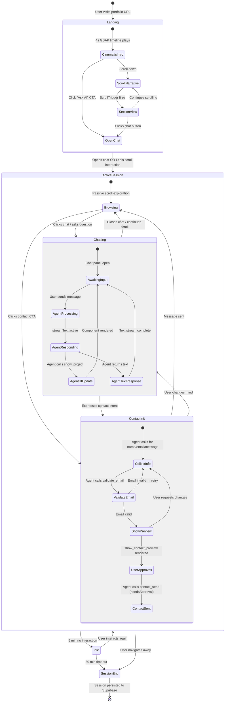
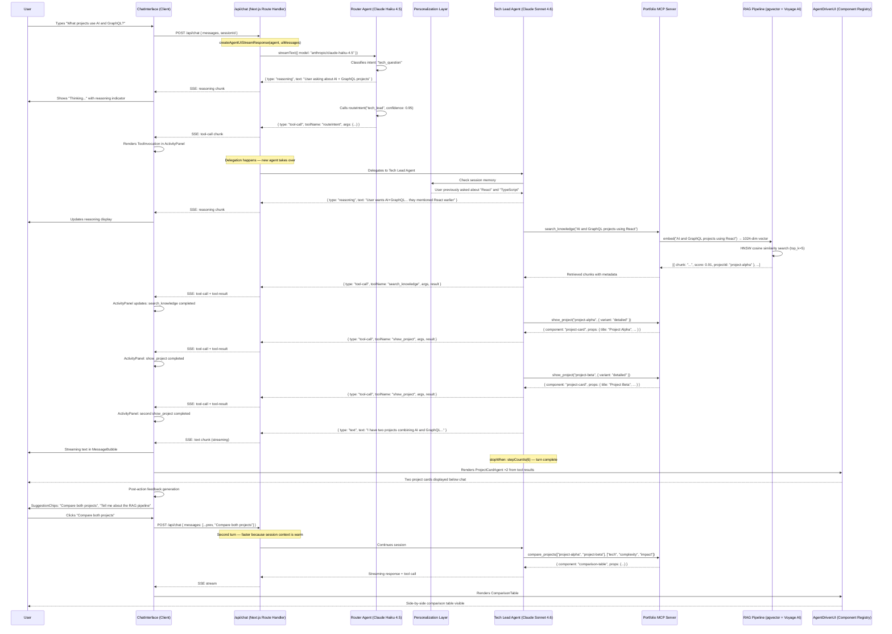
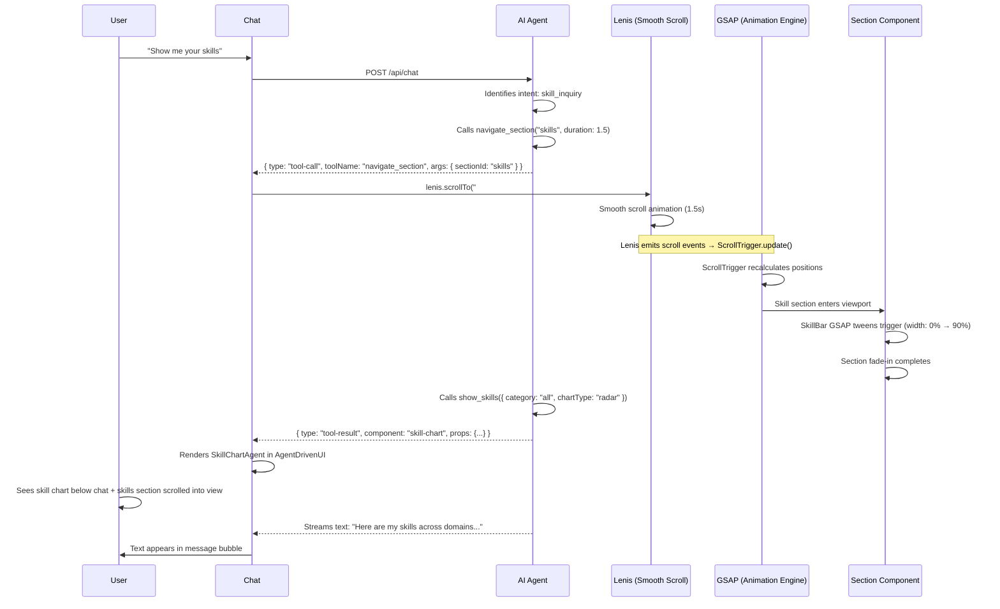
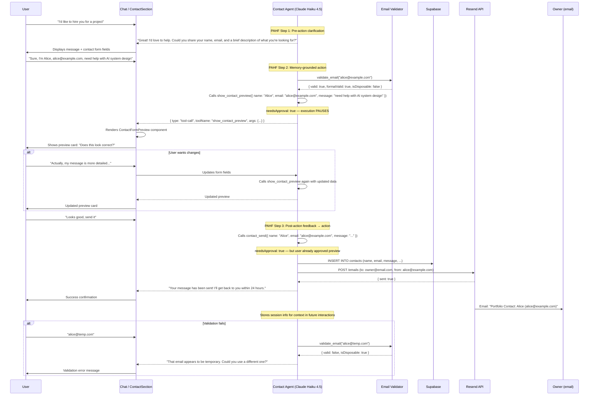
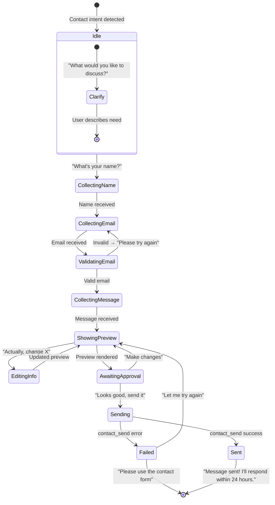
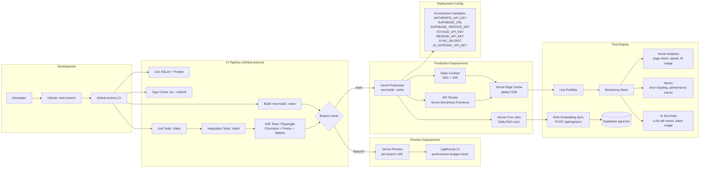
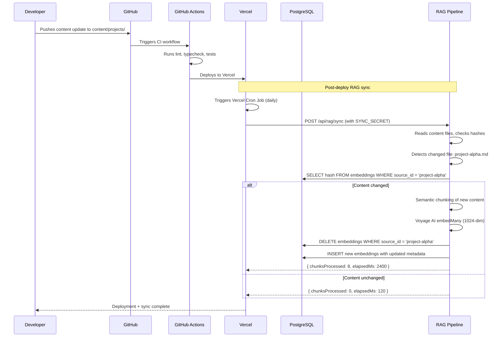

# AI-Native Interactive Portfolio Platform — Flow Diagrams

## 1. User Session Lifecycle



---

## 2. Chat Message Flow — Input → Routing → Tool Call → Stream → Render



### Stream Part Types (Vercel AI SDK v6 `UIMessage`)

```mermaid
graph LR
    subgraph "SSE Stream from createAgentUIStreamResponse"
        A[text delta] --> B{Message part type}
        C[tool-call] --> B
        D[tool-result] --> B
        E[source] --> B
        F[reasoning] --> B
        G[error] --> B
        H[step-start] --> B
        I[step-end] --> B
    end
    
    subgraph "Client Rendering (useChat → message.parts)"
        B --> J[StreamingText<br/>char-by-char]
        B --> K[ToolInvocation<br/>Collapsible card]
        B --> L[CitationMarker<br/>Superscript #1]
        B --> M[ReasoningBlock<br/>Expandable trace]
        B --> N[ErrorSurface<br/>What/Why/Next]
        B --> O[StepIndicator<br/>Progress bar]
    end
    
    subgraph "AgentDrivenUI (from tool-result with component)"
        K --> P[ComponentRegistry.lookup(type)]
        P --> Q[ProjectCardAgent]
        P --> R[SkillChartAgent]
        P --> S[ComparisonTable]
    end
```

---

## 3. RAG Retrieval Pipeline

```mermaid
flowchart TB
    subgraph "INGESTION (build-time + on-demand)"
        A1[profile.json] --> C[Semantic Chunker]
        A2[project READMEs] --> C
        A3[blog posts] --> C
        A4[skills.json] --> C
        
        C -->|source_type: profile| CH1[Chunk: Bio<br/>~200 tokens]
        C -->|source_type: profile| CH2[Chunk: Experience<br/>~300 tokens]
        C -->|source_type: project| CH3[Chunk: Project Alpha Arch<br/>~512 tokens]
        C -->|source_type: project| CH4[Chunk: Project Alpha Tech<br/>~512 tokens]
        C -->|source_type: skill| CH5[Chunk: React<br/>~128 tokens]
        
        CH1 --> EMB[Voyage AI voyage-3<br/>embedMany()]
        CH2 --> EMB
        CH3 --> EMB
        CH4 --> EMB
        CH5 --> EMB
        
        EMB -->|1024-dim vectors| PG[(pgvector HNSW<br/>m=16, ef_construction=200)]
        PG -->|metadata| PG
    end
    
    subgraph "QUERY TIME"
        Q[User Query: "Tell me about your RAG experience"] --> QE[Voyage AI embed<br/>input_type: "query"]
        QE --> VQ[1024-dim query vector]
        VQ --> HNSW[HNSW Search<br/>cosine similarity<br/>top_k=5]
        HNSW --> PG
        PG --> RAW[5 raw results<br/>scores: 0.92, 0.87, 0.81, 0.74, 0.65]
        
        RAW --> CONF{confidence<br/>check}
        CONF -->|min score > 0.7| RERANK[Cross-encoder<br/>re-ranker]
        CONF -->|min score < 0.7| EXPAND[Expand query<br/>+2 keyword synonyms]
        EXPAND --> QE2[Re-embed]
        QE2 --> HNSW2[HNSW Search<br/>top_k=5]
        HNSW2 --> RAW2[10 total results]
        RAW2 --> RERANK
        
        RERANK --> TOP3[Top 3 chunks<br/>re-ranked]
        TOP3 --> CTX[Context Window Assembly<br/>max 4000 tokens]
        
        CTX --> SYNTH[Synthesis: Claude Sonnet 4.6]
        
        subgraph "Context Window"
            CW1["Chunk: 'Built RAG pipeline with pgvector...'<br/>source: project-alpha<br/>score: 0.94"]
            CW2["Chunk: 'Experience with vector databases...'<br/>source: profile<br/>score: 0.89"]
            CW3["Chunk: 'Used Voyage AI for multilingual embeddings...'<br/>source: project-beta<br/>score: 0.85"]
        end
        
        CTX --> CW1
        CTX --> CW2
        CTX --> CW3
        
        SYNTH -->|streamText| RESP[Streaming Response<br/>+ Citations]
    end
    
    subgraph "FEEDBACK LOOP"
        RESP --> F{User feedback}
        F -->|thumbs up| LOG[Query Log: positive]
        F -->|thumbs down| LOG2[Query Log: negative]
        LOG --> ADJ[Adjust boost_factor<br/>for low-performing chunks]
        LOG2 --> ADJ
        ADJ --> PG
    end
```

### Chunking Detail

```mermaid
flowchart LR
    subgraph "Source: Project README"
        README["# Project Alpha
## Architecture
Built with Next.js...
## Tech Stack
- React 19
- pgvector
- Voyage AI

## Implementation
The RAG pipeline uses..."]

        S1[Semantic Splitter]
        README --> S1
        
        S1 --> SC1["Chunk 1: # Project Alpha
## Architecture
Built with Next.js..."]
        S1 --> SC2["Chunk 2: ## Tech Stack
- React 19
- pgvector
- Voyage AI"]
        S1 --> SC3["Chunk 3: ## Implementation
The RAG pipeline uses..."]
    end
    
    subgraph "Chunk Metadata"
        SC1 --> M1["metadata: {
  sourceType: 'project',
  sourceId: 'project-alpha',
  section: 'architecture',
  tokenCount: 48
}"]
        SC2 --> M2["metadata: {
  sourceType: 'project',
  sourceId: 'project-alpha',
  section: 'tech-stack',
  tokenCount: 24
}"]
        SC3 --> M3["metadata: {
  sourceType: 'project', 
  sourceId: 'project-alpha',
  section: 'implementation',
  tokenCount: 156
}"]
    end
    
    subgraph "Code Block Preservation"
        CODE["```typescript
const result = await retrieve({
  query: '...',
  topK: 5
});
```"]
        S1 --> CODE
        CODE --> CB["Chunk: code block
(tokenCount: 32)
Preserved as atomic unit
— never split mid-function"]
    end
```

---

## 4. Project Showcase Interaction Flow

```mermaid
stateDiagram-v2
    [*] --> GridView: User scrolls to projects section
    
    state GridView {
        [*] --> AllProjects: Default view
        AllProjects --> FilteredView: Clicks filter pill (e.g., "AI", "React")
        FilteredView --> AllProjects: Clicks "All"
        FilteredView --> FilteredView: Changes filter
    }
    
    GridView --> HoverState: Mouse enters project card
    HoverState --> GridView: Mouse leaves
    
    HoverState --> ModalView: Clicks project card
    HoverState --> ChatView: Clicks "Ask AI about this"
    
    state ModalView {
        [*] --> ProjectDetail: Modal opens (Framer Motion AnimatePresence)
        ProjectDetail --> TechDeepDive: Clicks "Architecture" tab
        ProjectDetail --> CodeView: Clicks "Code" tab
        ProjectDetail --> LinksView: Clicks "Links" tab
        TechDeepDive --> ProjectDetail: Switches tab
        CodeView --> ProjectDetail: Switches tab
        LinksView --> ProjectDetail: Switches tab
    end
    
    ModalView --> GridView: Closes modal
    
    ChatView --> AgentResponse: Sends "Tell me about {project}" to /api/chat
    
    AgentResponse --> GridView: Agent shows project card in chat
    AgentResponse --> ModalView: Agent calls show_project with variant: "full"
    AgentResponse --> GridView: User continues browsing
    
    state AgentResponse {
        [*] --> SearchingRAG: Agent searches for project context
        SearchingRAG --> CallingShowProject: Agent calls show_project tool
        CallingShowProject --> RenderingCard: project-card component spec returned
        RenderingCard --> StreamingText: Agent describes project
        StreamingText --> [*]: Response complete
    }
```

### Section Navigation via Agent



---

## 5. Contact Form Submission Flow



### Contact Agent State Machine



---

## 6. Deployment Pipeline



### Build-Time vs Runtime Data Flow

```mermaid
flowchart TB
    subgraph "Build Time (next build)"
        CONTENT[content/*.json, *.md] --> BUNDLE[Bundled into RSC]
        CONTENT --> SYNC[scripts/sync-embeddings.ts]
        SYNC --> CHUNK[Semantic Chunker]
        CHUNK --> EMBED[Voyage AI embedMany]
        EMBED --> PG[(pgvector HNSW)]
        
        PG --> RSC[Server Components<br/>read from PG at build]
        RSC --> HTML[Static HTML + RSC Payload]
    end
    
    subgraph "Runtime"
        USER[User Request] --> CDN[Vercel Edge Cache]
        CDN --> SSR[Server-Side Render<br/>or serve static]
        SSR --> CLIENT[Client Hydration]
        
        CLIENT --> CHAT[/api/chat<br/>Agent Orchestrator]
        CHAT --> MCP[MCP Server<br/>tools/list, tools/call]
        MCP --> RAG_QUERY[pgvector<br/>similarity search]
        
        CHAT --> CLAUDE[Anthropic API<br/>Haiku + Sonnet]
    end
    
    subgraph "On-Demand (ISR + Cron)"
        UPDATE[Content Update] --> WEBHOOK[GitHub Webhook]
        WEBHOOK --> ISR[Incremental Static Regeneration]
        WEBHOOK --> CRON_JOB[Vercel Cron Job]
        CRON_JOB --> RESYNC[Re-embed changed content]
        RESYNC --> PG
    end
```

### Async Task Lifecycle (for long-running operations)



---

## Key Flow Metrics

| Flow Step | Target Latency | Monitoring |
|---|---|---|
| User types → first token displayed | < 500ms | Vercel Analytics, AI DevTools |
| RAG query → results returned | < 200ms | Custom logging in retriever |
| Tool call → UI component rendered | < 300ms | Performance Observer |
| GSAP intro completes | < 4000ms | Lighthouse metric |
| Lenis scroll → GSAP animation sync | < 16ms (60fps) | RequestAnimationFrame timing |
| Contact form → email delivered | < 2000ms | Resend webhooks |
| Build time (full) | < 30s | GitHub Actions timing |
| RAG sync (50 chunks) | < 5s | Cron job metrics |
